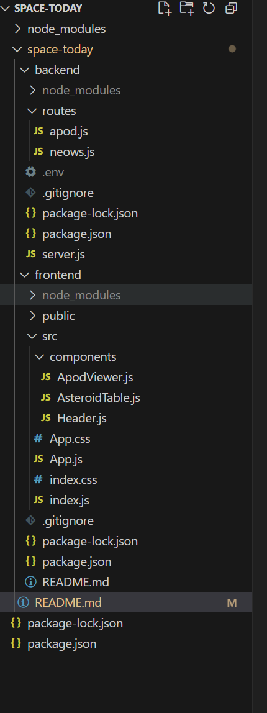

 # Space Today
 
A NASA dashboard that shows the Astronomy Picture of the Day (APOD) and near-Earth asteroids with data visualizations.

## Table Of Content 

 * [Technologies Used](#technologies-used)

* [Features](#features)

* [Project Structure](#project-structure)

* [Setup & Installation](#setup--installation)

* [Deployment](#deploymnet)

* [Screenshots](#screenshot)

### Technologies Used

| **Frontend**    | **Backend**     | **Other Tools**    |
|------------------|------------------|----------------------|
| React            | Node.js          | Git / GitHub         |
| React Router     | Express.js       | dotenv               |
| Recharts         |                  | Vercel / Render      |
| Axios            |                  | NASA APIs            |
| Bootstrap        |                  | CORS                 |

### Features

-  **View Astronomy Picture of the Day (APOD)**  
  Automatically shows NASA's daily space image with title and description.

-  **Select Any Date to View APOD**  
  Use a date picker to explore past images.

- **Explore Near-Earth Asteroid Data**  
  View a table of asteroids that passed close to Earth on the selected day.

-  **Charts for Asteroid Diameter and Distances**  
  Visualize data using bar and scatter plots powered by Recharts.

-  **Responsive Design**  
  Works well on desktop and mobile devices with a clean layout.

### Project Structure

 #### Project Structure (Descriptive Overview)

This project is organized into two main parts: a backend (Node.js + Express) and a frontend (React).

**backend/** – Contains the Express server, API routes for APOD and NeoWs, and environment configuration.

**routes/apod.js** – Handles Astronomy Picture of the Day requests.

**routes/neows.js** – Handles near-Earth asteroid data requests.

**.env** – Stores the NASA API key (not committed to Git).

**server.js** – Main backend server entry point.

**package.json** – Backend dependencies.

**frontend/** – Contains the React application with routing and reusable components.

**src/components/** – Includes ApodViewer.js, AsteroidTable.js, and Header.js.

**App.js** – Main app logic and page routing.

**index.js** – App entry point.

**App.css /** index.css – Styling files.

**package.json** – Frontend dependencies.

**README.md** – Project documentation.

**package-lock.json** – Auto-generated dependency lock file.

### Setup & Installation

1. #### Clone Repository 
    

You can find the full project here: 

[Space Today GitHub Repository](https://github.com/Aliona83/space-today.git)

2. #### Frontend setup

* cd space-today/frontend

* npm install

* npm start

3. Backend setup

* cd ../backend

* npm install

* npm start  # or node server.js if start is not defined

4. #### Add a .env file in the backend with:

* NASA_API_KEY=your_nasa_key_here

### Deploymnet

### Screenshot